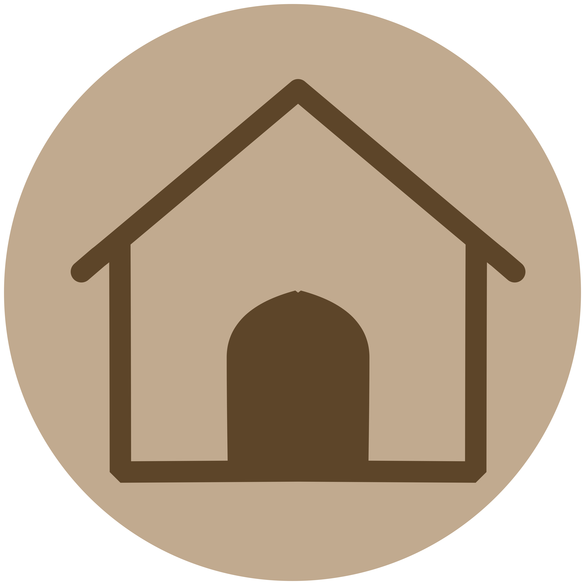

# My Safe Haven

<p align="center">
  
</p>

<p align="center">
  <strong>Una aplicación móvil para crear y gestionar zonas geográficas seguras donde puedes compartir contenido y chatear con personas cercanas.</strong>
</p>

<p align="center">
  
  
  
  
</p>

---

## Descripción

**My Safe Haven** es una aplicación móvil que permite a los usuarios crear "Havens" - zonas geográficas seguras definidas por coordenadas y radio. Dentro de estos Havens, los usuarios pueden:

- Crear y gestionar zonas geográficas personalizadas
- Chatear en tiempo real con otros usuarios dentro del mismo Haven
- Publicar contenido en el feed del Haven
- Recibir notificaciones en tiempo real mediante WebSockets
- Buscar y suscribirse a Havens cercanos a tu ubicación

## Arquitectura del Proyecto

```
My_Safe_Haven_PAMM/
├── Backend/                    # API REST con Flask
│   ├── my_safe_haven_back/    # Código fuente del backend
│   ├── db/                    # Scripts de inicialización de BD
│   ├── dockerfile             # Configuración Docker del backend
│   └── requirements.txt       # Dependencias Python
├── Frontend/                   # Aplicación Android con Kotlin
│   ├── app/                   # Código fuente de la app
│   ├── gradle/                # Configuración Gradle
│   └── build.gradle.kts       # Configuración de compilación
├── Informe/                   # Documentación del proyecto
├── Presentacion/              # Presentación del proyecto
├── docs/                      # Documentación adicional (MkDocs)
├── docker-compose.yml         # Orquestación de contenedores
└── mkdocs.yml                 # Configuración de documentación
```

## Tecnologías Utilizadas

### Frontend (Android)
- **Kotlin** - Lenguaje de programación principal
- **Jetpack Compose** - UI declarativa moderna
- **Material Design 3** - Sistema de diseño
- **Hilt** - Inyección de dependencias
- **Retrofit** - Cliente HTTP
- **Socket.IO** - Comunicación en tiempo real
- **Google Maps API** - Integración de mapas y geolocalización

### Backend
- **Python 3** - Lenguaje de programación
- **Flask** - Framework web
- **Flask-SQLAlchemy** - ORM para base de datos
- **Flask-JWT-Extended** - Autenticación JWT
- **Flask-SocketIO** - WebSockets para tiempo real
- **PostgreSQL 17** - Base de datos relacional

### DevOps
- **Docker** - Contenedorización
- **Docker Compose** - Orquestación de servicios
- **GitHub Actions** - CI/CD
- **GitHub Pages** - Documentación

## Inicio Rápido

### Prerrequisitos
- Docker y Docker Compose instalados
- Android Studio (para desarrollo del frontend)
- Git

### Instalación

1. **Clonar el repositorio**
   ```bash
   git clone https://github.com/NicolasReyAlonso/My_Safe_Haven_PAMM.git
   cd My_Safe_Haven_PAMM
   ```

2. **Iniciar los servicios con Docker**
   ```bash
   docker-compose up --build
   ```
   
   Esto iniciará: 
   - Base de datos PostgreSQL en el puerto `5432`
   - Backend API en el puerto `5050`

3. **Conectar a la base de datos (opcional)**
   ```bash
   ./connectToDB.sh
   ```

4. **Configurar el Frontend**
   - Abrir la carpeta `Frontend/` en Android Studio
   - Sincronizar las dependencias de Gradle
   - Configurar la IP del backend en `RetrofitClient. kt`
   - Ejecutar la aplicación en un emulador o dispositivo físico

## 📱 Características de la Aplicación

### Autenticación
- Registro de usuarios con email y contraseña
- Login con username o email
- Tokens JWT para sesiones seguras

### Gestión de Havens
- Crear Havens con nombre, ubicación y radio
- Usuarios gratuitos:  máximo 3 Havens
- Usuarios Pro:  Havens ilimitados
- Visualización en mapa interactivo

### Sistema de Chat
- Chat en tiempo real dentro de cada Haven
- Notificaciones push mediante WebSockets
- Historial de mensajes persistente

### Feed de Posts
- Publicar contenido en el Haven
- Ver publicaciones ordenadas cronológicamente

## API Documentation

La documentación completa de la API está disponible en [`Backend/README.md`](Backend/README.md).

### Endpoints Principales

| Método | Endpoint | Descripción |
|--------|----------|-------------|
| POST | `/register` | Registrar nuevo usuario |
| POST | `/login` | Iniciar sesión |
| GET | `/users/me` | Obtener usuario actual |
| GET | `/havens` | Listar Havens del usuario |
| POST | `/havens` | Crear nuevo Haven |
| GET | `/havens/<id>/messages` | Obtener mensajes del Haven |
| POST | `/havens/<id>/messages` | Enviar mensaje al Haven |

## Testing

### Backend
```bash
./testBack.sh
```

### Frontend
Los tests se encuentran en: 
- `Frontend/app/src/test/` - Tests unitarios
- `Frontend/app/src/androidTest/` - Tests instrumentados

## Documentación

La documentación del proyecto está disponible mediante MkDocs: 

```bash
# Instalar MkDocs
pip install mkdocs

# Servir documentación localmente
mkdocs serve
```

O visita la documentación desplegada en GitHub Pages. 

## Contribuir

1. Fork el proyecto
2. Crea tu rama de feature (`git checkout -b feature/AmazingFeature`)
3. Commit tus cambios (`git commit -m 'Add some AmazingFeature'`)
4. Push a la rama (`git push origin feature/AmazingFeature`)
5.  Abre un Pull Request

## Autores

- **Nicolás Rey Alonso** - [@NicolasReyAlonso](https://github.com/NicolasReyAlonso)
- **Jerónimo Omar Falcón Dávila** - [@jerofd-02](https://github.com/jerofd-02)

## Licencia

Este proyecto es parte de un proyecto académico (PAMM).

---

<p align="center">
  Desarrollado usando Kotlin y Python
</p>