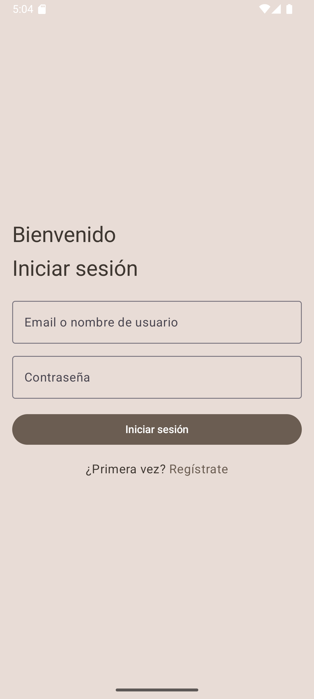
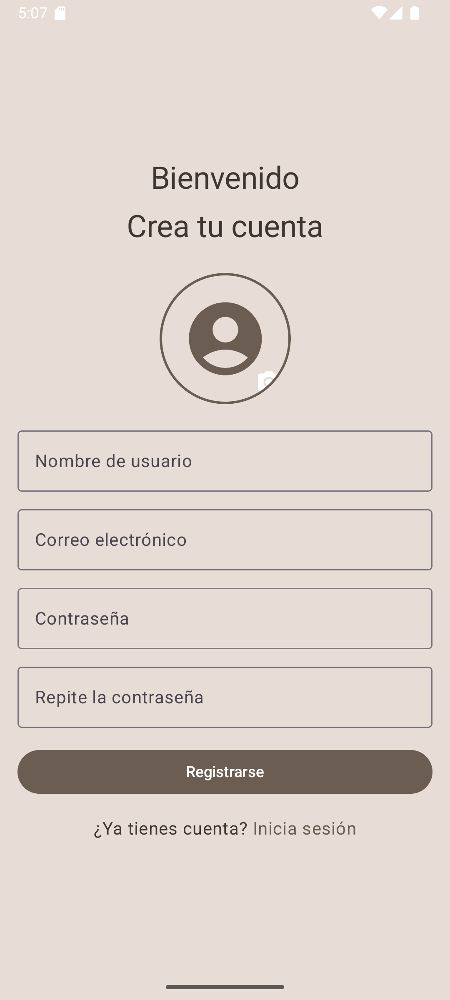
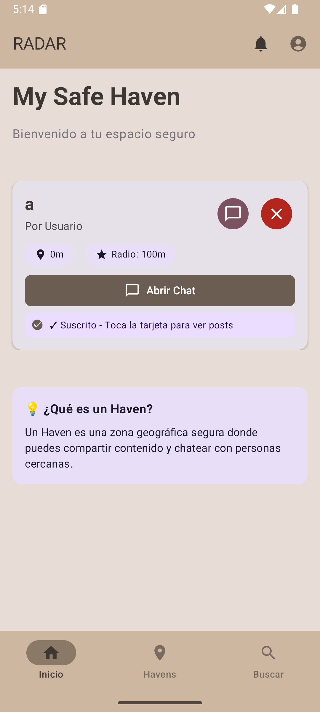

# Inicio de sesión y pantalla principal

## Inicio de sesión
Cuando iniciamos la aplicación por primera vez, nos pide iniciar sesión en esta pantalla:

## Registro
Si no nos hemos registrado en la aplicación, podemos dar al botón de Regístrate en la parte inferior

Para el registro lo único que nos pedirá será:
- Foto de perfil (opcional)
- Nombre de usuario
- Correo electrónico
- Contraseña (pedida dos veces para confirmar)

## Pantalla principal
Una vez iniciamos sesión en la aplicación nos saldrá los Havens a los que estamos suscritos y una breve explicación de lo que es un Haven:

Desde aquí podremos abrir el chat, los posts y desuscribirnos de el/los Haven(s).