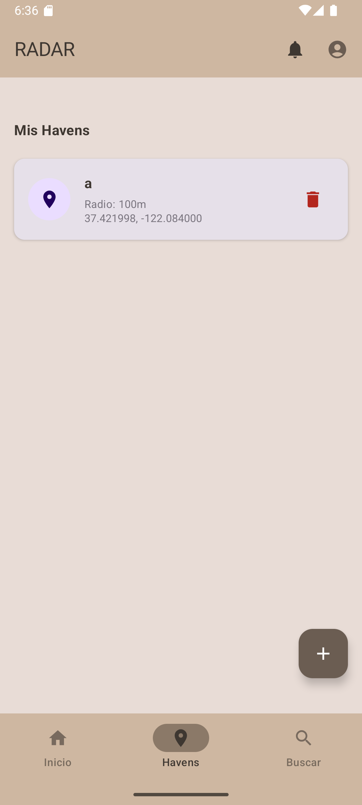
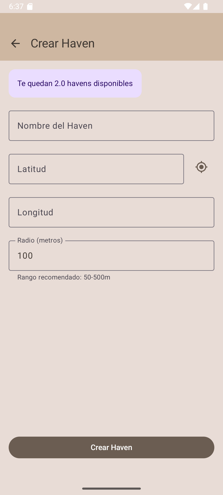
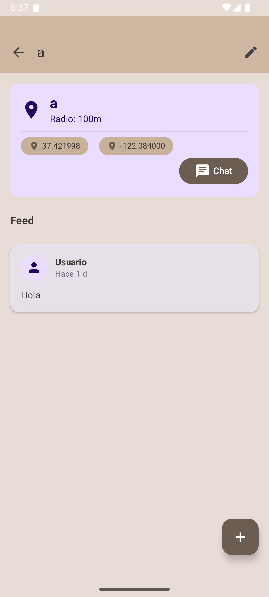
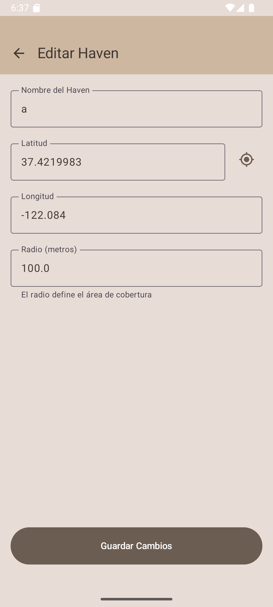
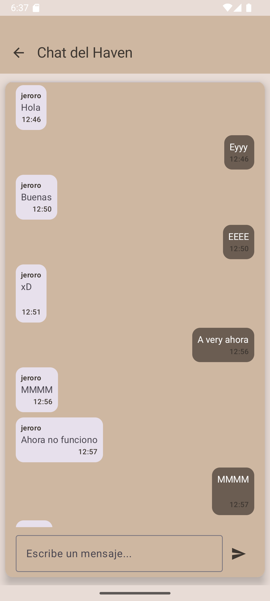
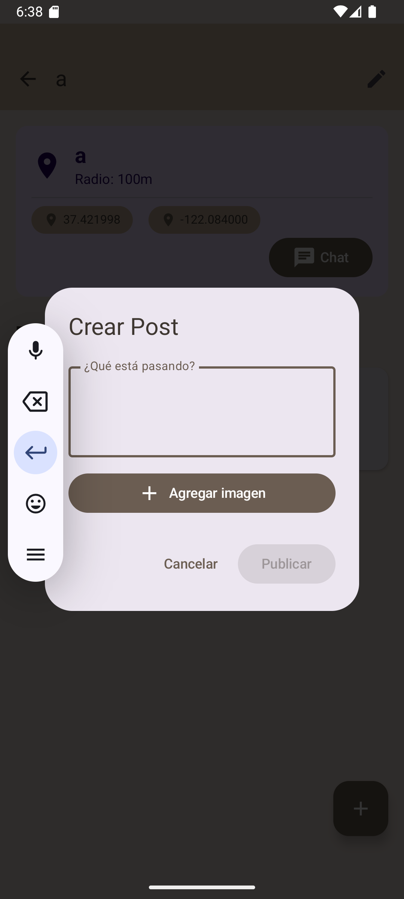

# Mis Havens

## Pantalla principal de Havens
En la pantalla principal nos encontramos con los Havens que hemos creado, también en el botón **+**, podemos crear otro Haven y en el icono de la papelera podemos eliminar el Haven

## Crear Haven
Si hemos pulsado el botón **+**, podemos crear un nuevo Haven. Los usuarios gratuitos están limitados a la creación de 3 Havens.

## Detalles, edición y chat del Haven
Si pulsamos la tarjeta del haven podemos ver los detalles:

Desde ahí, también podemos editar el Haven en el icono del lápiz:

Y ver el chat en el botón de **Chat**:

## Crear Posts
Podemos crear posts dentro del Haven, estos post podrán tener imágenes y/o texto.
